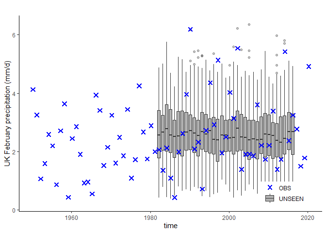
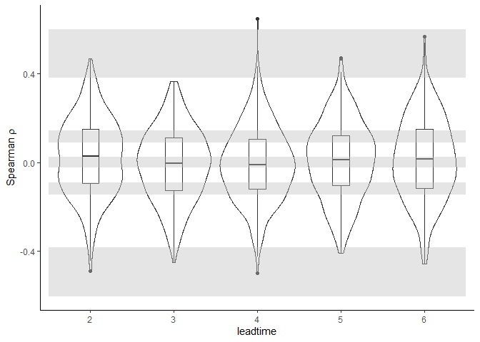
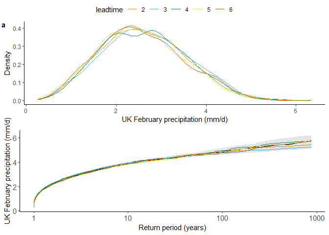
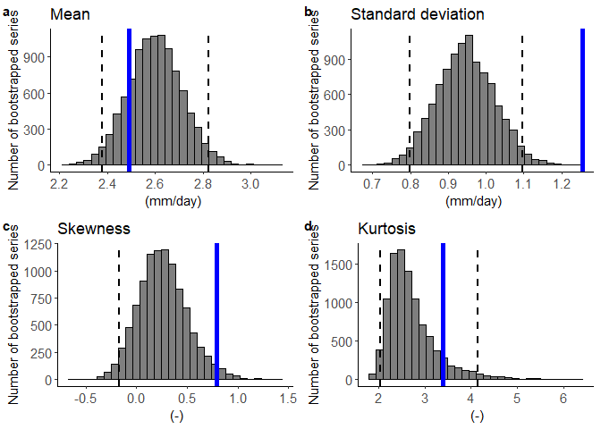

[](https://zenodo.org/badge/latestdoi/280199921)

<!-- README.md is generated from README.Rmd. Please edit that file -->

# UNSEEN

<!-- badges: start -->

<!-- badges: end -->

The UNprecedented Simulated Extreme ENsemble (UNSEEN, [Thompson et
al., 2017](https://www.nature.com/articles/s41467-017-00275-3)) approach
is an increasingly popular method that exploits seasonal prediction
systems to assess and anticipate climate extremes beyond the observed
record. The goal of this package is to provide easy evaluation of the
UNSEEN method. This package is developed as part of the ECMWF Summer of
Weather Code ([ESoWC 2020](https://github.com/esowc/UNSEEN-open)) using
in particular for the ECMWF SEAS5 hindcast data.

## Installation

<!-- You can install the released version of UNSEEN from [CRAN](https://CRAN.R-project.org) with: -->

<!-- ``` r -->

<!-- install.packages("UNSEEN") -->

<!-- ``` -->

You can install the development version from
[GitHub](https://github.com/) with:

``` r
# install.packages("devtools")
devtools::install_github("timokelder/UNSEEN")
```

## Example

This is a basic example which shows you how to plot the UNSEEN
timeseries and apply the independence, stability and fidelity tests
using an example dataset:

``` r
data("EOBS_UK","SEAS5_UK")
```

``` r
library(UNSEEN)
## basic example code

unseen_timeseries(ensemble = SEAS5_UK, obs = EOBS_UK, ylab = 'UK February precipitation (mm/d)')
```



``` r
independence_test(ensemble = SEAS5_UK)
#> Warning: Removed 1625 rows containing non-finite values (stat_ydensity).
#> Warning: Removed 1625 rows containing non-finite values (stat_boxplot).
```



``` r
stability_test(ensemble = SEAS5_UK, lab = 'UK February precipitation (mm/d)')
#> Warning: Removed 4 row(s) containing missing values (geom_path).
```



``` r
fidelity_test(obs = EOBS_UK$rr, ensemble = SEAS5_UK$tprate)
```


